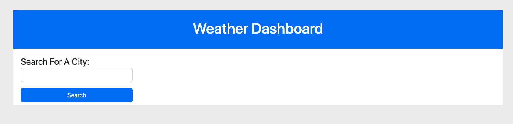
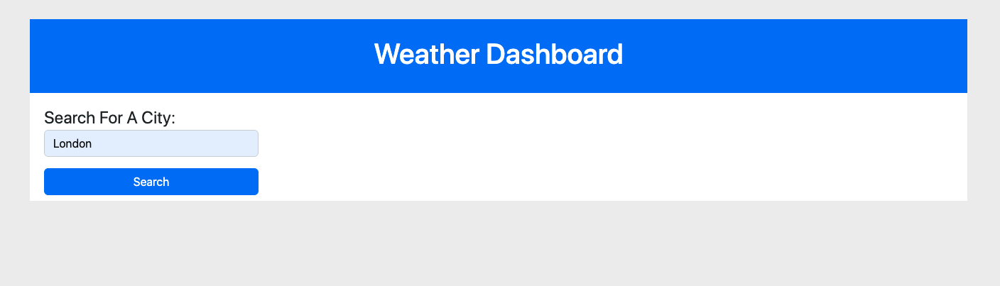
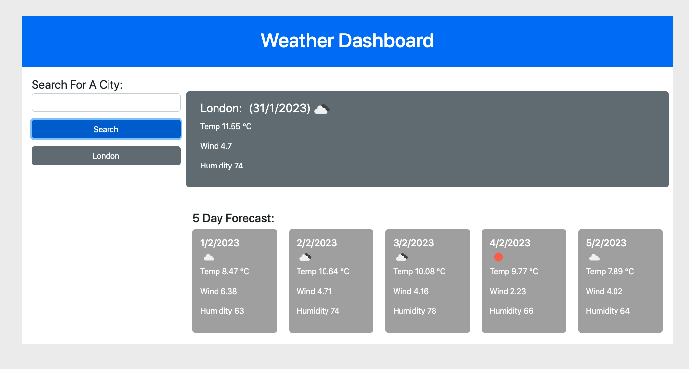
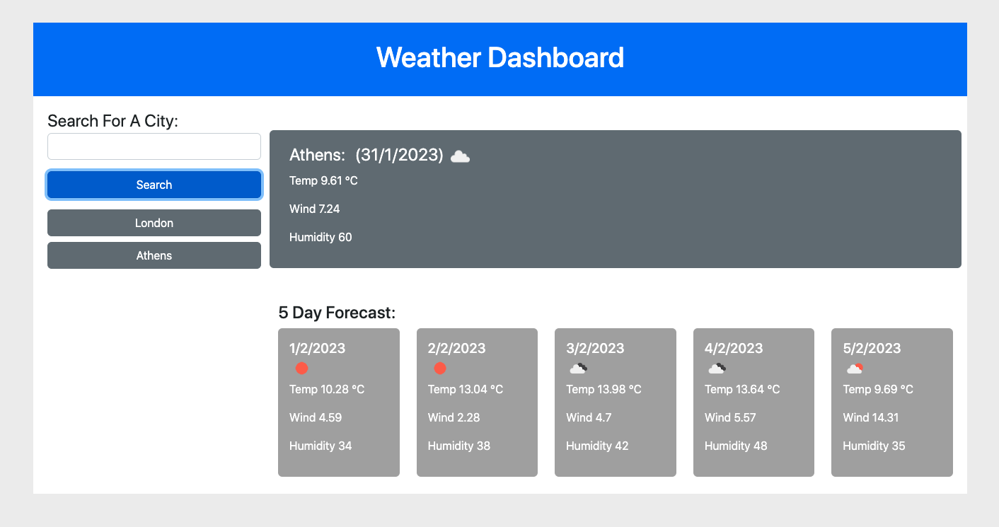
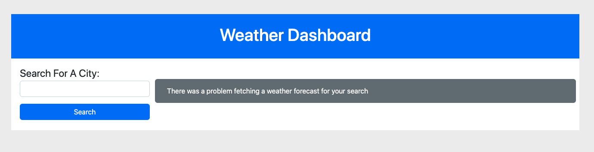

# Module 8 Challenge: Weather Dashboard

## Overview

This web app was created for the purpose of gaining experience working with server API's. The application allows the user
to search for a city, and are then presented with the current weather forecast, and a 5 day forecast. The app has the following features:

- [If the search returns a city, the city is stored in local storage, and is displayed as a collection of buttons]
- [The history buttons link to the search that generated them]
- [If the user searches for a city they previously searched for, the city is not stored in local storage]
- [The user's search term is converted to catital letter first, followed by lower case]

The app also validates the user input by ensuring that:

- [They enter a valid city in the search field]
- [If there is a fetch error, the user is presented with an error message]

The application uses the following screens:

## Initial screen Screen

## User enters a city name

## Screen showing search results, plus initial search history

## Screen showing search results, plus multiple search history buttons

## Screen showing error message if city cannot match search

## Deployment

The application wa deployed to GitHub Pages using the following process:

- [Pushing the refactored files to a remote repository]
- [From the repository, select the Settings tab on the right side of the page]
- [In the section labeled Source, select the `main` branch as your source]
- [Click 'save']
- [The app is now available on GitHub Pages (see 'usage' below for access details)]

## Usage

To view the app visit:

https://welsh-bloke.github.io/weather-dashboard/

## License

Please refer to the LICENSE in the repo.
